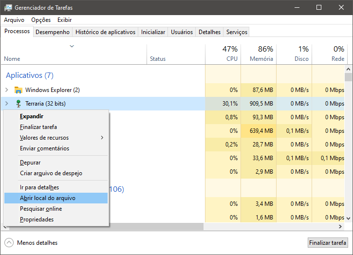
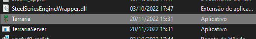
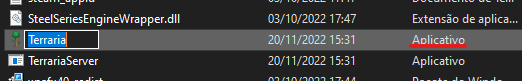
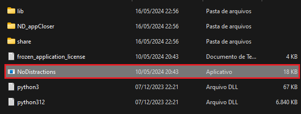
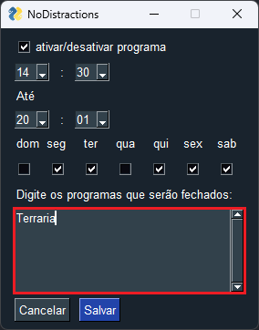
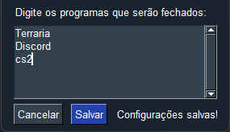

# NoDistractions

### O programa NoDistracions é capaz auxiliar no foco, terminando a execução de programas e aplicativos selecionados que retiram a atenção do usuário.

## Como usar:

#### 1. Pressione **Ctrl+Shift+Esc** para abrir o gerenciador de tarefas. Em seguida procure o programa ou aplicativo desejado que está executando.

(O jogo Terraria servirá apenas de exemplo)

#### 2. Clique com o botão direito do mouse e selecione "Abrir local do arquivo". Isso abrirá a pasta onde o programa está contido e irá selecionar o executável.

#### 3. Com o executável selecionado, pressione **F2** e em seguida **Ctrl+C** para copiar o nome do mesmo.

#### 4. Vá para a pasta do NoDistractions e abra o executável "NoDistractions"

#### 5. Clique na caixa de texto e pressione **Ctrl+V**, em seguida configure o horário e dias da semana em que o NoDistractions irá funcionar.

#### Obs: A cada novo programa deve-se pular uma linha

### Após clicar em "Salvar" e fechar o aplicativo, o programa responsável por terminar a execução das distrações irá executar em segundo plano
